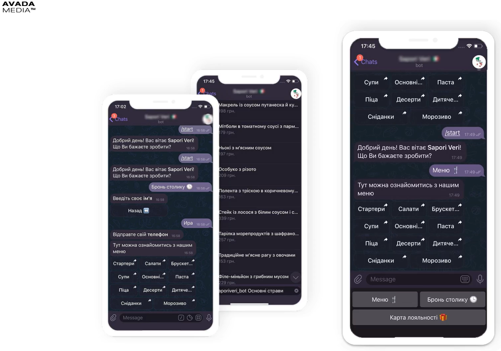

РОЗДІЛ 1

АНАЛІЗ ПРЕДМЕТНОЇ ОБЛАСТІ І ПОСТАНОВКА ЗАДАЧІ

1.1  Проблеми розвитку інформаційних технологій в сфері ресторанного бізнесу

Більшість закладів харчування надають можливість споживачам своїх послуг
отримувати необхідну інформацію, залишати відгуки, замовляти товари чи послуги
на сайті. Це зручно клієнтам закладів харчування, але власникам ресторанного
бізнесу потрібно вкладати не малі кошти у створення, розвиток, підтримку і
модернізацію своїх інтернет ресурсів.

Також на сьогодні є велика кількість мобільних застосунків, що допомагають
замовляти товари чи послуги зі смартфонів. Однак власникам бізнесу чи
співробітникам потрібно виконати роботи для додавання свого закладу до таких
служб. Ці роботи передбачають:

-   заповнення форми контактів;

-   складання і підписання договору співпраці;

-   завантаження меню та контенту;

-   встановлення застосунку та навчання персоналу роботі в ньому.

За використання таких застосунків сплачується 20-30% від кожного замовлення.
Тобто, клієнт отримує товар із націнкою, або власник отримує менший прибуток.

Ще однією можливістю надати клієнтам можливість отримувати відклик від закладу і
корисну інформацію є використання чат-ботів. Чат-бот це віртуальний помічник, що
розташований у месенджері. Він може виконувати такі задачі, як:

-   інформування клієнтів про послуги;

-   надання меню закладу;

-   виклик персоналу;

-   бронювання столиків та інше.

    Перевагами цього варіанту є:

-   інтегрованість до месенджеру (відсутність необхідності створювати застосунок
    для взаємодії споживача із закладом харчування. Клієнт не повинен ставити
    нове ПЗ за для використання чат-боту, бо він працює у месенджерах, що з
    високою вірогідністю вже встановлені на його смартфоні);

-   інформаційні запити не вимагають уваги персоналу (відповіді на такі питання,
    як години роботи, меню закладу, відгуки та пропозиції здатен надавати
    чат-бот без втручання співробітника);

    ???

1.2  Аналіз існуючих інформаційних технологій в сфері ресторанного бізнесу,
    пов’язаних із використанням чат-ботів

Через значну корисність чат-ботів при прийнятній вартості їх створення,
компанії, що профілюються на створенні програмного забезпечення для ресторанного
бізнесу пропонують замовляти чат-ботів замість дорогих застосунків.

Одна з таких компаній – українська компанія Avada media пропонує створення
телеграм-бота (Рис. 1) для закладів харчування. Компанія пропонує малому та
середньому бізнесу, а саме, власникам кафе, піцерій, бургерних і т. д.,
створення чат-бота для прийняття і обробки замовлень у відповідності до
технічного завдання. Avada media пропонує замовнику можливість не встановлюючи
жодних додаткових застосунків, використовуючи лише месенджер Telegram
здійснювати наступні дії:

-   переглядати меню (із можливістю його розгалуження за категоріями);

-   обирати і замовляти страви;

-   вказувати місце і час доставки;

-   обирати і вказувати спосіб оплати;

-   залишати у спеціальному діалоговому вікні побажання для персоналу та
    відгуки;

-   брати участь в програмі лояльності (отримувати промокоди і накопичувати
    бали).

    

    Рисунок 1

Зарубіжна компанія AventaSoft Ltd виробляє it-рішення для автоматизації
ресторанного бізнесу більше десяти років. Розробники пропонують власникам
закладів харчування створення власної служби доставки за 48 годин (Рис. 2), що
наразі і є чат-ботом із можливостями:

-   завжди мати актуальне меню із урахуванням специфіки страв;

-   прийняття заказів без оператора;

-   відмови від дорогого смс-інформування;

-   повної підтримки програми лояльності.

Переваги чат-бота від AventaSoft Ltd:

-   простота і ефективність використання;

-   зниження витрат на персонал і ризиків людського фактора;

-   управління за допомоги вбудованого бек офісу;

-   елементарний інтерфейс;

-   брендування бота;

-   швидкий запуск бота в роботу.

Рисунок 2

Компанія Яндекс в березні 2018 року відкрила нові можливості для користувачів
голосового помічника «Аліса». Тобто, можна створювати нові навички і
прив’язувати їх до сервісу (Рис. 3). На сьогодні «Вертер», розроблений Яндексом
для взаємодії з «Алісою» вже надає користувачам можливість розробки чат-ботів
без програмування під такі види месенджерів як:

-   Telegram

-   WhatsApp

-   Viber

Вертер є безкоштовним. До переваг використання чат-бота компанія Яндекс
відносить:

-   можливість дізнаватися думки клієнтів про обслуговування;

-   оперативність відповідей на часті питання;

-   бронювання столиків;

-   можливість отримувати сповіщення про новинки та акціі.

Рисунок 3

1.3  Висновки по розділу

В розділі було розглянуто пропозиції компаній, що створюють ПЗ для ресторанного
бізнесу використовуючи чат-ботів, що підтримуються сучасними месенджерами:
Telegram, WhatsApp, Viber. Також було визначено переваги використання чат-ботів
закладами харчування.
